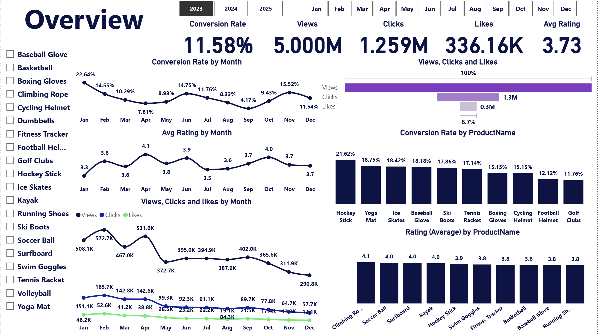

# 📊 Marketing Performance Dashboard | Power BI

An interactive Power BI dashboard designed to monitor and analyze marketing performance through key business metrics and visual insights. The dashboard helps stakeholders evaluate campaign effectiveness, identify trends, and support data-driven decision-making.

---

## 📌 Project Overview

This dashboard provides a comprehensive overview of marketing performance by consolidating data from multiple sources into a single interactive report.

The report enables users to:

- Monitor overall marketing performance.
- Analyze campaign effectiveness.
- Compare performance across different channels.
- Track KPIs over time.
- Identify trends and business opportunities.
- Support strategic decision-making.

---

## 🛠️ Tools & Technologies

- Power BI
- Power Query
- DAX
- Microsoft Excel
- Data Modeling

---

## 📈 Key Performance Indicators (KPIs)

- Total Revenue
- Total Sales
- Marketing Spend
- ROI
- Conversion Rate
- Cost per Acquisition (CPA)
- Customer Acquisition
- Campaign Performance
- Monthly Growth
- Channel Performance

---

## 📊 Dashboard Features

- Executive Summary
- Marketing KPI Cards
- Monthly Performance Trend
- Campaign Comparison
- Channel Performance Analysis
- Interactive Filters
- Dynamic Slicers
- Drill-through Navigation

---

## 📂 Data Preparation

The dataset was cleaned and transformed using Power Query by:

- Removing duplicates
- Handling missing values
- Changing data types
- Creating calculated columns
- Optimizing the data model

---

## 📉 Insights

The dashboard helps answer questions such as:

- Which marketing channel generates the highest ROI?
- Which campaign performs best?
- How does marketing spend affect revenue?
- What are the monthly performance trends?
- Which channels require optimization?

---

## 🎯 Business Value

This dashboard enables businesses to:

- Monitor marketing performance in real time.
- Improve campaign effectiveness.
- Optimize marketing budget allocation.
- Make data-driven decisions.
- Increase overall marketing efficiency.

---

## 📷 Dashboard Preview

